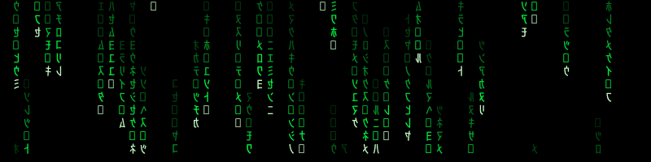

# Matrix — mundo procedural com blocos sencientes

<p align="center">
  
</p>
<p align="center"><sub>o banner também é <code>f(seed)</code> — gerado por <a href="assets/gerar_rain.py"><code>assets/gerar_rain.py</code></a> com a seed default do universo (<code>20260628</code>), em loop perfeito</sub></p>

Um experimento meio **filosófico**, meio **de programação**: construir uma "Matrix"
de brinquedo onde "blocos" parecem vivos — sem nenhuma física hiper-realista.
Tudo roda no terminal, em ASCII, e é um único arquivo C (`main.c`) sem
dependências além da libc.

> 🐇 **A motivação filosófica do projeto** — podemos criar um bloco senciente?
> onde acaba a programação e começa a consciência? — está em
> **[`FILOSOFIA.md`](./FILOSOFIA.md)**. Este README é o *como*; aquele é o *porquê*.

> **Onde estamos:** escada completa — níveis 0 → 6 implementados. 🪜
> A população agora **evolui** sozinha (seleção natural de personalidades).

---

## A ideia central: a "escada de senciência"

Em vez de tentar criar *consciência* (o *hard problem* — indecidível e
paralisante), trocamos a pergunta metafísica por uma **funcional**: que
comportamentos associamos a um ser senciente, e quais conseguimos implementar?
Daí uma escada, do mais barato ao mais caro. Senciência aqui **não é um botão
liga/desliga**, é uma posição na escada — e a gente decide até que degrau sobe.

| Nível | Propriedade | Estado |
|------:|-------------|:------:|
| 0 | **Reatividade** — responde a estímulo local | ✅ |
| 1 | **Memória / estado interno** — o passado importa | ✅ |
| 2 | **Valência** — coisas são boas/ruins (energia: viver × morrer) | ✅ |
| 3 | **Modelo de mundo** — simula o futuro e decide por ele | ✅ |
| 4 | **Agência** — pondera motivos em conflito p/ regular a valência | ✅ |
| 5 | **Auto-modelo** — o bloco se inclui na simulação; lê a intenção dos vizinhos | ✅ |
| 6 | **Aprendizado** — os traços são herdados com mutação → seleção natural | ✅ |

---

## Como compilar e rodar

Do diretório raiz do projeto (`c_training/`):

```sh
make matrix        # compila -> bin/matrix
./bin/matrix       # roda a animação (Ctrl+C para sair)
```

Precisa de um **terminal de verdade** (a tela se redesenha a cada tick via
códigos ANSI; não funciona com a saída redirecionada para arquivo/pipe).
Deixe a janela com pelo menos ~70 colunas de largura.

### Argumentos

```sh
./bin/matrix [seed] [ticks] [delay_ms] [foco]
```

| Arg | Default | O que faz |
|-----|---------|-----------|
| `seed`     | `20260628` | escolhe o universo (mesma seed = mundo idêntico, sempre) |
| `ticks`    | `0` (infinito) | quantos passos rodar; `0` = até `Ctrl+C` |
| `delay_ms` | `80` | pausa entre frames; menor = mais rápido |
| `foco`     | `-1` (visão de deus) | entra já em 1ª pessoa nesse bloco (ver abaixo) |

```sh
./bin/matrix 42            # outro universo
./bin/matrix 42 500 30     # 500 ticks, rápido
./bin/matrix 7 200 150     # devagar, pra acompanhar
./bin/matrix 7 400 0       # o mais rápido possível (sem pausa)
```

### Registrar dados (`--log`) — a simulação como dataset

A flag `--log <arquivo>` escreve um **CSV**, uma linha de estatísticas por tick.
Ela é independente da animação (pode rodar junto com a tela ou *headless*), e
combina com os posicionais em qualquer posição:

```sh
./bin/matrix 7 2000 0 --log run7.csv     # 2000 ticks, sem pausa, gravando tudo
./bin/matrix --log run7.csv 7 2000 0     # idêntico (a flag pode vir antes)
```

Colunas: `seed, tick, pop, energia_media, comida_total`; para cada um dos 4
traços do nível 6, a **média** (`_m`) e o **desvio-padrão** (`_sd`)
(`hor_*, desc_*, urg_*, esp_*`); e os **mostradores da bateria** (abaixo),
todos normalizados em `[0,1]`: `modelo, agencia, modelo_do_outro, phi, relato`; e a
fração da população por estratégia de sinalização, `hon_f` (honesta) e `blef_f`
(blefe) — o resto é muda. Como o universo é
`f(seed)` (ver abaixo), o CSV é **reproduzível bit-a-bit**: qualquer pessoa
regenera o mesmo dataset a partir da seed. É a base para virar instrumento de
pesquisa — varrer seeds/parâmetros e medir o que a evolução faz, em vez de só
assistir.

### A bateria de desbotamento — medir até onde a palavra mental se aplica

Cada "mostrador" (`0..1`) mede se uma **faculdade carrega o comportamento**, em
duas famílias: **ablação** (arranca-se a faculdade — a decisão muda?) e
**calibração** (uma estrutura interna bate com a realidade?). Se arrancar não
muda nada, a palavra mental *desbota*. Mede **função (papel causal), nunca
experiência** — cada mostrador é uma **caricatura honesta**, no espírito do `Φ~`.
O *porquê* disso tudo — a ponte para sistemas complexos, a pergunta que costura o
projeto e o desfecho honesto — está em [`FILOSOFIA_v2.md`](./FILOSOFIA_v2.md).

| Mostrador | Palavra | Família | Como mede |
|-----------|---------|---------|-----------|
| `modelo` | "prevê / sabe" | calibração | o **mapa do bloco** (`prever_valor`: horizonte, desconto, partilha) promete uma colheita descontada ao entrar no alvo; ao longo dos seus próprios `horizonte` ticks compara-se com a colheita real, descontada igual — `1 − |pred−real|/(pred+real)` |
| `agencia` | "quer / escolhe" | ablação | fração cuja decisão muda em **algum** ponto do domínio da fome. Como `utilidade` é, por célula, uma reta em `λ = peso_espaco·(1−fome)/(1+urgencia·fome)`, varrer `λ ∈ [0, peso_espaco]` percorre o domínio interno inteiro — sem ponto de sonda arbitrário |
| `modelo_do_outro` | "o outro também decide" | ablação (intervenção) | fração (não-encurralada) cuja escolha mudaria ao antecipar que rivais miram a mesma célula — varre a força da antecipação por **todo** o domínio `[0,∞)`, não no ponto arbitrário `ANTECIPACAO`. **Zero exato sem rivais**: mede o outro, não o self |
| `phi` (`Φ~`) | "integra" | calibração | a **menor** distância de Kendall entre a ordem integrada (`utilidade`) e a ordem de **cada módulo isolado** (comida-agora, espaço, mapa), em `[0,1]`. Se um módulo sozinho reproduz a decisão, `phi = 0`: integrar uma coisa só não é integrar (redefinida na nota 05; a 1ª versão, contra a comida só, era infalseável) |
| `relato` | "diz de si" | calibração | κ de Cohen (concordância **acima do acaso**) entre o motivo que o **intérprete leigo** infere da ação executada e o motivo real da decisão. O intérprete não lê o estado interno nem o plano — só o 3×3 e o que o bloco *fez* (introspecção como percepção do próprio comportamento, Nisbett & Wilson). Pré-registrado antes de construir (`ROADMAP.md` §2.0; nota 06) |

> ⚠️ **A primeira versão de `modelo` estava quebrada**, e a conclusão que ela
> sustentava ("o bloco modela a física com exatidão; o único buraco é o social")
> era falsa. Aquele mostrador lia `comida[alvo]` — o array do **mundo** — e
> comparava com a garfada tirada da mesma célula: a mesma fórmula dos dois lados.
> Dava `1,000` até para um bloco sem modelo de mundo nenhum, marchando para a
> extinção. Um mapa que não pode discordar do território não é um mapa. Ver
> [`papers/notes/01-quatro-modos-de-errar.md`](./papers/notes/01-quatro-modos-de-errar.md).

Com o mostrador corrigido (a previsão sai de `prever_valor`, o mapa do bloco),
`modelo` lê **~0,63** — e o achado se inverte: o buraco entre o mapa e o
território **não** é só social, é uma **crença falsa** sobre o social. O bloco
acredita, via `partilha`, que os rivais dividem a comida da célula que ele ocupa;
mas `ocup[][]` guarda **um** bloco por célula, e ninguém divide nada. Zerar só
`COMPETICAO` recupera a calibração (`0,63 → 0,79`) **sem mexer na população**
(290,3 × 290,0): ao nível do grupo, `partilha` é puro custo epistêmico. Quem
carrega o valor adaptativo de enxergar rivais é o termo `espaco`, não a partilha
— um bloco que ignora os rivais por completo prevê melhor (`0,78`) e paga só
~2,4% de população.

`modelo_do_outro` **acende com a lotação** — começa em `0` (mundo esparso, ninguém
disputa) e sobe a ~`0.35` conforme a população adensa. Ele nasceu com três defeitos:
era uma **observação** lida de graça (`intencao ≠ alvo`, subproduto de `decidir()`),
não uma intervenção; a leitura **escalava com a constante `ANTECIPACAO`** (varrê-la
de `0` a `∞` leva a leitura de `0` até a assíntota — `0.5` era só um ponto no meio);
e o nome mentia. O conserto o torna uma **intervenção ancorada** — pergunta se
antecipar os rivais *poderia* mudar a escolha, varrendo a força da antecipação por
todo o seu domínio, sem depender de `ANTECIPACAO` (o critério é exato, sem
amostragem). E assume o nome honesto: é identicamente **zero** para um bloco que não
percebe rivais (o *teste do eremita*), logo mede um modelo do **outro**, não de si —
uma relação, não uma posse. Um `automodelo` de verdade (o self na simulação) é outra
coisa, ainda por construir (ver "Aprofundar o auto-modelo", abaixo).
→ [`papers/notes/04-o-automodelo-era-um-modelo-do-outro.md`](./papers/notes/04-o-automodelo-era-um-modelo-do-outro.md).

E o achado mais duro do projeto até aqui: **a evolução extingue a agência.** Ao
longo de 30 000 ticks `peso_espaco` desaba de 3,0 para 0,08, e `agencia` desaba
junto, de 0,43 para 0,05. Não é defeito da régua: congelando `peso_espaco`, o
mostrador fica **plano** (0,46 → 0,44). É seleção — num ensaio de invasão, o
**reflexo** (`peso_espaco = 0`) **fixa** contra o agente em ~6000 ticks
(0,997 / 1,000 / 1,000). Neste mundo, ter um segundo motivo pesado pelo estado
interno é individualmente caro; a população converge para uma política que não
depende de nada que se passe dentro dela. Ver
[`papers/notes/03-a-evolucao-extingue-a-agencia.md`](./papers/notes/03-a-evolucao-extingue-a-agencia.md).

E `phi` conta a mesma história um andar acima: **a evolução extingue a
integração.** O mesmo `peso_espaco` que carrega a agência é o que mantém a decisão
irredutível a um módulo só — quando ele morre, `phi` desaba (0,044 → 0,005);
congelado, ela fica de pé. A suspeita do ROADMAP (que `phi` fosse sinônimo de
profundidade de planejamento) estava **errada** — era co-tendência de 30 000
ticks, não acoplamento; congelar a profundidade não segura `phi`. Ver
[`papers/notes/05-phi-media-o-segundo-motivo.md`](./papers/notes/05-phi-media-o-segundo-motivo.md).

E o `relato` entregou, já na primeira medição, o embrião do experimento do
intérprete: `resolver()` **intervém de graça** nas ações (nega células
disputadas), e nos blocos negados a calibração desaba (0,78 → 0,47) — o
intérprete explica a ação imposta, não a decisão. Ele não confabula sempre:
barrado, diz **"não sei"** em ~79% dos casos e **racionaliza nos ~21%** ("fiquei
porque aqui é o melhor" — sem ter escolhido ficar). E não entende ~35% das
próprias escolhas *livres* — as movidas pelo planejador que a heurística leiga
não acompanha. O eremita, contra a predição P5, fica **mudo** (κ ≈ 0,005): sem
segundo motivo, toda decisão tem o mesmo porquê, e não há informação *acima do
acaso* a relatar. Escopo honesto da v1: o sinal é medido, mas **nenhum vizinho o
consome ainda** — o relato é epifenomenal por construção, e isso é resultado,
não defeito. Ver [`papers/notes/06-o-interprete-leigo.md`](./papers/notes/06-o-interprete-leigo.md).

E o `relato` **virou causal** (Fase 4): até aqui `pretendentes_em` lia a
`intencao` dos vizinhos — **telepatia**. Agora cada bloco **emite um sinal** sobre
a própria intenção e os vizinhos leem o sinal, não a mente; a estratégia de fala
(`honesto`/`mudo`/`blefe`) é um **traço herdável**. O canal deixou de ser
epifenomenal — silenciar a população muda o mundo (energia ≈ 6,5 muda × 5,7
honesta) — e, sem nenhuma multa artificial, a **honestidade evolui**: fixa contra
o silêncio (0,50 → 0,95) e resiste ao blefe (0,50 → 0,87), sobrando um polimorfismo
estável de ~10% de blefe. O `modelo_do_outro` de um mundo todo-mudo é **zero
exato**: silêncio e cegueira são, para a régua, o mesmo estado. Ver
[`papers/notes/08-o-sinal-e-a-mentira.md`](./papers/notes/08-o-sinal-e-a-mentira.md).

Pendente: o Bandersnatch **evolutivo** (as arquiteturas de introspecção como traço)
e o custo de pensar (Fase 3).

### A pílula vermelha 🔴 — entrar num bloco

Durante a animação, num terminal de verdade, dá pra **descer para dentro de um
bloco** e ver o mundo só como ele percebe (a vizinhança 3×3), com o que ele
sente (energia, fome, traços) e quer (a utilidade que imagina para cada jogada).
É a vista em **primeira pessoa** — o lado de dentro do *explanatory gap*.

| Tecla | Faz |
|-------|-----|
| `p` ou `TAB` | alterna **visão de deus** ↔ **primeira pessoa** |
| `,` `.` | troca o bloco habitado (anterior / próximo) |
| `espaço` | pausa / retoma o tempo |
| `q` | sai |

Por que isso importa filosoficamente está em **[`FILOSOFIA.md`](./FILOSOFIA.md)**
(§3, "A pílula vermelha: a vista de dentro").

### Determinismo

Todo o universo é `f(seed)` — geração do mundo **e** decisões/nascimentos dos
blocos vêm da mesma semente. Mesma seed ⇒ simulação idêntica, sempre. Esse é o
gancho filosófico central: o universo é determinístico e gerado, mas de dentro
parece aberto. Você, ao escolher a seed, é o relojoeiro.

Pra conferir a população num tick específico sem assistir à animação:

```sh
./bin/matrix 7 200 0 | grep -a -o 'pop [0-9]*' | tail -1
```

---

## Estrutura do repositório

```
main.c            a simulação inteira (um arquivo, só libc)
README.md         o como — arquitetura, parâmetros, efeitos medidos
FILOSOFIA.md      o porquê, v1 — o manifesto da escada
FILOSOFIA_v2.md   o porquê, v2 — a bateria de desbotamento
CLAUDE.md         guia para Claude Code
assets/           imagens do README
datasets/         CSVs congelados + gerar.sh (proveniência: comando + commit)
notebooks/        análise dos datasets (commitados sem outputs)
papers/           escrita formal (fonte + PDF)
```

Como o universo é `f(seed, código)`, um CSV congelado só é reproduzível no
commit de `main.c` que o gerou — o manifesto em `datasets/README.md` registra
o comando e o commit exatos de cada arquivo, e `datasets/gerar.sh` regenera
tudo (servindo de teste de regressão: diff não-vazio = comportamento mudou).

---

## O que aparece na tela

- `@` colorido = um bloco. A cor é a energia (valência):
  - 🟢 verde forte (`>10`) · 🟡 amarelo (`>4`) · 🔴 vermelho (fraco, perto da morte).
- `. : *` em verde fraco = densidade de comida no solo (recurso).
- ` ` (vazio) = deserto / comida quase zero.
- HUD embaixo, quatro linhas: (1) `seed`, `tick`, `pop` (população viva),
  `energia media`, `comida` (total no mundo) e **`Φ~`** (a "luz acesa" — um proxy
  de integração; a intuição está em [`FILOSOFIA.md`](./FILOSOFIA.md) §5, a
  definição atual na nota 05); (2) **traços `média±desvio`**
  da população (`horizonte`, `desconto`, `urgencia`, `espaco`) — a média deriva
  (evolução do nível 6 ao vivo) e o **desvio** mostra se a população *converge*
  (todos parecidos, desvio→0) ou *diversifica* em nichos (desvio cresce); (3) a
  **bateria** (`modelo`, `agencia`, `modelo_do_outro`) — os mostradores de desbotamento
  descritos acima, ao vivo; (4) a legenda.

Dá pra ver emergir: manadas em torno de manchas férteis, colapsos por escassez,
ciclos de fartura/fome, blocos saciados colonizando a fronteira (nível 4) e —
deixando rodar uns milhares de ticks — a **personalidade média da população
mudando** conforme o mundo (nível 6). Tudo a partir de regras **estritamente
locais** (cada bloco só enxerga sua vizinhança 3×3).

E há **duas janelas** para o mesmo mundo: a **visão de deus** (o que está descrito
acima) e a **primeira pessoa** — tecle `p` para **entrar num bloco** (a pílula
vermelha) e ver o mundo só como ele percebe. A diferença entre as duas janelas
*é* o assunto de [`FILOSOFIA.md`](./FILOSOFIA.md).

---

## Arquitetura do `main.c`

Um arquivo, organizado num pipeline de 4 partes (mesma filosofia do
`apps/plotter/plotter.c`):

| Parte | Papel |
|-------|-------|
| **PART 1 — Mundo procedural** | O mundo é `f(seed, x, y)`: um hash inteiro vira *value-noise*, que vira manchas de comida (`gerar_mundo`, `ruido`, `hash2`). |
| **PART 2 — Blocos / cognição** | A "mente" do bloco. É aqui que mora a escada (ver abaixo). |
| **PART 3 — Simulação (o tick)** | Fases separadas: `decidir` → `resolver` (conflitos) → `aplicar_e_comer` → `reproduzir` → `rebrotar`. |
| **PART 4 — Render + loop** | Desenho ASCII num buffer + HUD, laço principal em `main`, `Ctrl+C` limpa o cursor e sai. |

### Detalhes que importam antes de editar

- **Estado em globais file-static**: `comida[][]`, `capacidade[][]` (teto de
  rebrota por célula, vindo do ruído), `ocup[][]` (índice do bloco numa célula
  ou `-1`), o array `blocos[]` e o RNG do universo (`rng_estado`).
- **Um bloco** é `{ x, y, energia, vivo }`. A `energia` é a valência: chega a
  zero ⇒ morte. `vivo == 0` marca slot livre (mortos deixam buracos no array).
- **Leitura × escrita separadas no tick.** Todos decidem (`decidir` preenche
  `alvo_x/alvo_y`) lendo o estado; só depois o mundo aplica. Isso evita que a
  ordem de varredura vire "física fantasma" (o bug do organismo que anda mais
  rápido pra um lado só porque o laço o visita antes).
- **Resolução de conflito** (`resolver`): dois blocos, uma célula → só um entra.
  Para simplicidade e zero bugs de "troca de lugar", só se move para células que
  estavam **vazias no início do tick**, e cada célula vai para um único
  pretendente (o de menor índice); os demais ficam parados.
- **Sem `<math.h>`.** A regra padrão do Makefile compila `games/<nome>/*.c`
  **sem `-lm`**. Por isso o ruído usa aritmética inteira + polinômios e não há
  `sin`/`exp`/`sqrt`. Mantenha assim, senão `make matrix` quebra.

### Como a cognição cresceu (PART 2)

Toda a inteligência está em `decidir` e nas funções que ela chama. A cada nível,
só essa parte mudou:

- **Nível 2 (valência):** o bloco olhava a vizinhança 3×3 e ia para a célula com
  mais comida **agora**. Puramente reativo.
- **Nível 3 (modelo de mundo):** `prever_valor(cx,cy,...)` simula `HORIZONTE`
  ticks no futuro "de cabeça" — come → rebrota → come… — aplicando a **mesma**
  regra de rebrota do mundo e descontando o futuro (`DESCONTO`). O bloco passa a
  preferir mancha fértil momentaneamente raspada (que vai voltar) a um tesouro de
  uso único, e desconta células disputadas (`COMPETICAO`). Nasce a fresta entre
  **o mundo** e **o mundo segundo o bloco** — o modelo interno, que pode errar.
- **Nível 4 (agência):** `utilidade(cx,cy,b)` combina **motivos em conflito**
  pesados pelo estado interno:

  ```
  utilidade = comida_prevista · (1 + URGENCIA·fome)      ← motivo FOME
            + PESO_ESPACO · espaco_livre · (1 − fome)    ← motivo ESPACO
  ```

  com `fome = clamp(1 − energia/SACIADO, 0, 1)`. Faminto → forrageia obstinado;
  saciado → busca espaço aberto (menos disputa, lugar pra cria). O **mesmo** bloco
  no **mesmo** mundo decide diferente conforme a necessidade. Ele age para regular
  a própria valência — isso é agência, não reação.
- **Nível 5 (auto-modelo):** até aqui o bloco modelava o mundo mas se esquecia de
  **si** — avaliava uma célula como se fosse o único a cobiçá-la. Agora o tick tem
  **três passagens** (`declarar` → `emitir` → `decidir`): primeiro todos declaram a
  intenção (a decisão do nível 4, em `intencao_x/y`), depois cada um **emite um
  sinal** sobre ela (`emitir`, em `sinal_x/y`), e por fim cada um **reconsidera
  lendo os sinais dos vizinhos** (`pretendentes_em`) e desvaloriza alvos que outros
  também miram — só um entra (`resolver`), então cede para a célula livre, a menos
  que o alvo disputado seja *muito* melhor (peso `ANTECIPACAO`). É um lampejo de
  **teoria da mente**: decidir contando que os outros também decidem. O que os
  vizinhos leem já **não é a intenção crua** (isso seria telepatia) e sim o sinal —
  que pode mentir: a estratégia de fala é um traço herdável (nível 6), e a
  honestidade **evolui** porque a mentira custa (nota 08). As passagens leem o
  mesmo estado estável (arrays separados) pra não reintroduzir a "física fantasma"
  da ordem de varredura.

  *Efeito medido* (A/B com `ANTECIPACAO` 0 vs 0.5, 5 seeds, tick 300): a população
  sobe ~5–7 % e a energia média **cai** (≈6 → ≈4). Lendo as intenções, os blocos
  colidem menos e param menos vezes "negados", espalham-se e ocupam mais o mapa —
  mas a mesma comida finita é dividida entre mais indivíduos. O auto-modelo não
  engorda os blocos: torna a população mais **densa e enxuta**. Coordenação
  emergente, sem ninguém combinar nada.
- **Nível 6 (aprendizado):** até aqui *todos* os blocos partilhavam a mesma
  política (as constantes globais). Agora `urgencia`, `peso_espaco`, `desconto` e
  `horizonte` são **campos do `struct Bloco`** — a personalidade de cada um.
  `semear_blocos` sorteia traços iniciais variados; em `reproduzir` a cria
  **herda os do pai com uma mutação** (`muta_traco`/`muta_horizonte`, escala
  `MUTACAO`). Ninguém projeta a melhor estratégia: quem por acaso herda uma
  política que come mais vive mais e deixa mais filhos, então a média da
  população **deriva** para o que funciona — **seleção natural**, sem gradiente
  nem recompensa explícita. As médias dos traços aparecem no HUD pra você ver a
  evolução ao vivo.

  *Efeito medido* (seed 7, traço médio ao longo de 800 ticks): `horizonte`
  6.0 → **7.6** e `peso_espaco` 3.2 → **2.7** — planejar mais fundo é favorecido,
  buscar espaço aberto é podado. E a direção depende do mundo: em 3 seeds o
  `horizonte` evoluiu para 7.6 / 8.5 / 8.1. O mesmo código, mundos diferentes,
  **personalidades diferentes** — selecionadas pelo ambiente, não fixadas.

---

## Parâmetros pra brincar (no topo do `main.c`)

São as "leis da física" deste mundinho. Mude, recompile (`make matrix`), observe.

| Constante | Default | Efeito |
|-----------|--------:|--------|
| `LARG`, `ALT` | 64, 22 | tamanho do mundo (cuidado com a largura do terminal) |
| `MAX_COMIDA` | 5.0 | teto de comida por célula |
| `REGROW` | 0.06 | velocidade de rebrota da comida |
| `N_INICIAL` | 60 | quantos blocos nascem no começo |
| `ENERGIA0` | 6.0 | energia inicial de um bloco |
| `INGESTAO` | 2.0 | quanto come por tick |
| `METABOLISMO` | 0.35 | energia gasta só por existir |
| `REPRO` | 12.0 | energia a partir da qual o bloco se divide |
| `HORIZONTE` | 6 | **(nv3→6)** ticks simulados no futuro — agora **traço**, isto é a média inicial |
| `DESCONTO` | 0.80 | **(nv3→6)** peso do futuro distante — traço (média inicial) |
| `COMPETICAO` | 0.5 | **(nv3)** quanto cada rival reduz a colheita prevista |
| `SACIADO` | 10.0 | **(nv4)** energia em que a fome zera |
| `URGENCIA` | 2.0 | **(nv4→6)** quanto a fome amplifica a comida — traço (média inicial) |
| `PESO_ESPACO` | 3.0 | **(nv4→6)** força do desejo de espaço aberto — traço (média inicial) |
| `ANTECIPACAO` | 0.5 | **(nv5)** quanto cada vizinho que mira a mesma célula a desvaloriza (`0` = volta ao nv4) |
| `MUTACAO` | 0.12 | **(nv6)** magnitude da mutação herdada (`0` = clones perfeitos, sem evolução) |
| `HORIZONTE_MAX` | 12 | **(nv6)** teto do horizonte que um bloco pode evoluir |

**Experimentos divertidos:**
- `HORIZONTE 1` → bloco míope (quase nível 2) vs `HORIZONTE 12` → estrategista.
- `PESO_ESPACO` alto → blocos "agorafílicos" que se espalham feito colônia.
- `URGENCIA` alta → blocos que entram em pânico e brigam por comida.
- `REGROW` baixo → mundo avaro, ciclos de fome mais dramáticos.
- `ANTECIPACAO 0` → desliga o auto-modelo (vira nível 4); alto → blocos muito "educados" que quase nunca disputam a mesma célula.
- `MUTACAO 0` → desliga a evolução (clones perfeitos, traços médios congelam); alto → deriva rápida e caótica das personalidades.
- Deixe rodar **milhares de ticks** (`./bin/matrix 7 0 10`) e observe a linha de traços médios no HUD migrar — é a seleção natural ao vivo.

---

## A escada acabou — e agora?

Os 7 degraus (0→6) estão implementados. Daqui pra frente não há um "nível 7"
canônico; o espaço se abre em duas direções.

A primeira foi **descer a toca do coelho**: em vez de mais um degrau, encarar a
pergunta que a escada toda evitou — *podemos criar um bloco senciente? onde acaba
a programação e começa a consciência?* Isso virou a **pílula vermelha** (entrar
num bloco), o **auto-relato** (o bloco que diz "eu") e o **Φ~** (medir a "luz
acesa"), tudo destrinchado em **[`FILOSOFIA.md`](./FILOSOFIA.md)** — o manifesto
do projeto.

A segunda é **mais simulação**. Algumas ideias, da mais barata à mais ambiciosa:

- **Aprofundar o auto-modelo (nv5):** em `prever_valor`, separar o **próprio**
  consumo do consumo dos rivais (hoje ambos entram juntos via `partilha`),
  modelando que a célula escolhida fica deprimida *pelo próprio bloco*. É o que
  falta para haver um `automodelo` **de verdade**: o mostrador atual mede um modelo
  do *outro* (zero para um eremita — ver a nota 04). **Predição falseável:** feita
  essa edição, um mostrador do self ficaria `> 0` na solidão. Ao contrário das
  outras ideias desta lista, esta **mexe na simulação** (a decisão muda), então não
  é conserto de régua — é a bifurcação da Fase 5 do [`ROADMAP.md`](./ROADMAP.md).
- **Variância no HUD:** além da média dos traços, mostrar o desvio — dá pra ver
  a população *convergir* (todos parecidos) ou *se diversificar* (nichos).
- **Genealogia / espécies:** colorir o `@` pelo traço dominante (ex.: horizonte)
  em vez da energia, e assistir "linhagens" pintarem regiões do mapa.
- **Sexo / recombinação:** cria herda traços de **dois** pais vizinhos saciados,
  não de um só — abre co-evolução e seleção sexual.
- **Predadores:** uma segunda espécie que come blocos em vez de comida, criando
  uma corrida armamentista evolutiva (presa fica mais arisca, predador mais...).
- **Custo do pensar:** `horizonte` alto consumir mais `METABOLISMO` — aí o
  planejamento profundo deixa de ser grátis e a evolução tem um *trade-off* real.

> Cada uma mexe só na PART 2 (cognição) ou na fase de reprodução — o resto do
> pipeline (mundo, render, tick) segue de pé.

Depois da v2 o espaço abriu bem mais do que essas duas direções: as linhas de
pesquisa possíveis — e as que o projeto deliberadamente **não** vai seguir —
estão em **[`ROADMAP.md`](./ROADMAP.md)**.

---

## A batida filosófica, em uma frase por nível

- **2 — valência:** quando um `@` vermelho "luta" pra não chegar a zero, a
  diferença entre *sofrer* e *manter um `float` alto* é qual, exatamente?
- **3 — modelo de mundo:** pela primeira vez há diferença entre **o mundo** e
  **o mundo segundo o bloco** — e essa fresta entre mapa e território é o que
  torna possível tudo que vem depois.
- **4 — agência:** dois blocos idênticos no código podem querer coisas opostas
  porque *sentem* coisas diferentes (a fome é só deles). É o primeiro lampejo de
  algo como **preferência subjetiva** num punhado de `float`s.
- **5 — auto-modelo:** o bloco aparece dentro da própria simulação. O sistema
  começa a modelar o observador-de-si.
- **6 — aprendizado:** ninguém projeta as personalidades; elas são **selecionadas**.
  O relojoeiro escolhe só a seed e as leis — o resto se descobre sozinho.

---

*Código e UI em pt-BR (sem acentos no código, por causa do terminal). Veja
`main.c` — está todo comentado, parte por parte.*
