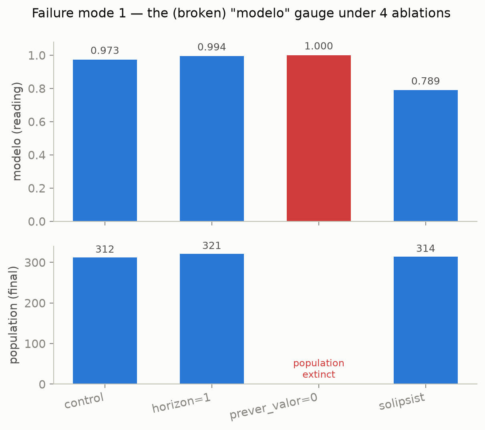
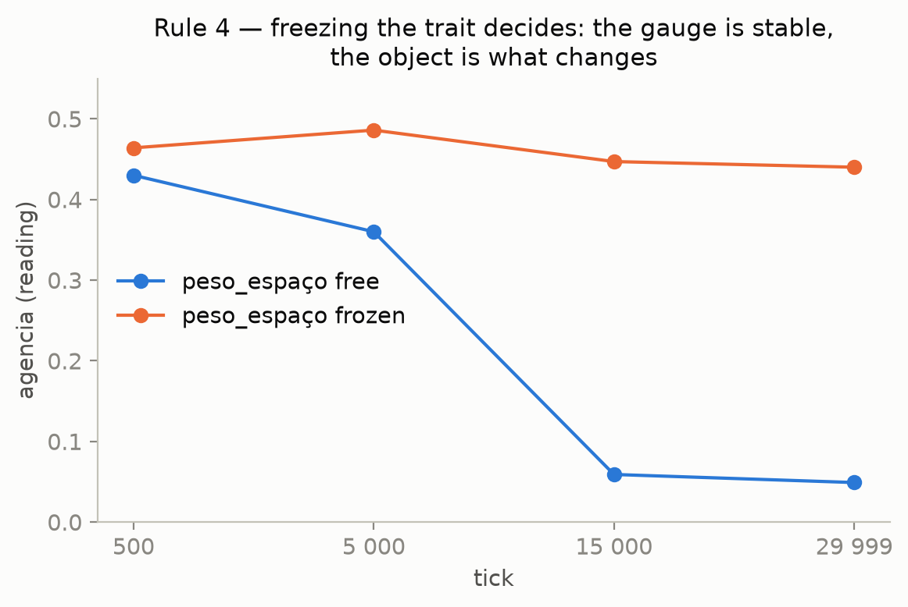
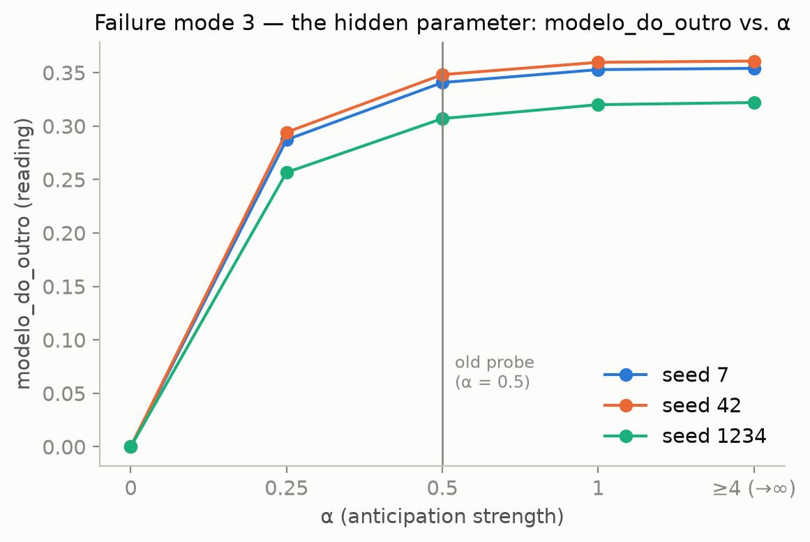
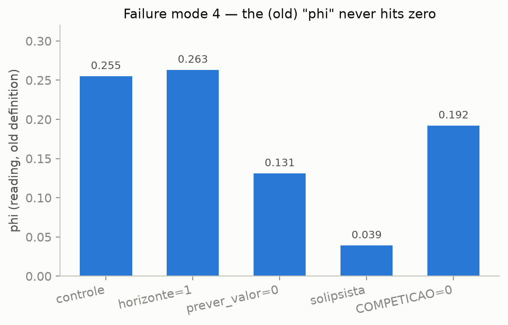
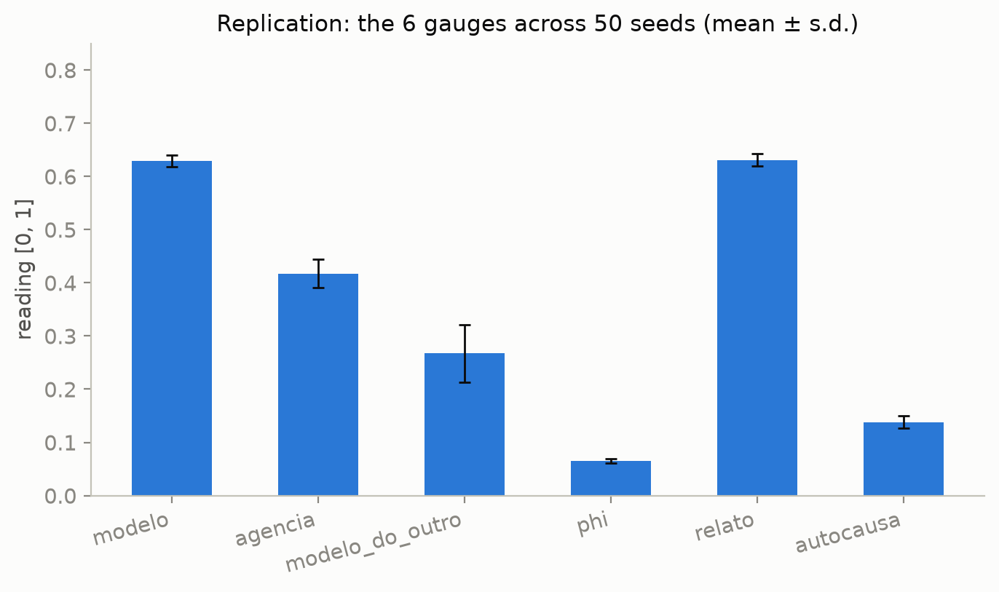

# Four rulers of the mind, four ways to fail

### Metrology of a sentience battery in a 56 KB world

*(preprint — English translation of `papers/paper-1-quatro-reguas.md`; source of record remains the Portuguese original)*

---

## Abstract

We built a battery of six gauges to ask, of agents in a minimal simulated
world, whether faculties like *world model*, *agency*, *self-model*, and
*integration* **carry behavior**. Then we tried to break it. The four
original gauges all failed — each in a structurally different way, and
**none of the failures was visible before we tried to break them**. One gave
a perfect score to an extinct population. One had its anchor co-evolving
with the object it measured. One was an observation dressed up as an
intervention, with a hidden parameter and a name that misdescribed the
faculty. One was unfalsifiable: no ablation could ever drive it to zero.

This paper records the four failure modes, their mechanisms, and their
fixes, and extracts two results that are not about the simulation:

1. **Any metric in the *calibration* family can be satisfied by a probe that
   reads the environment instead of the agent's representation.** A map
   that cannot be wrong is not a map; the mark of representation is the
   possibility of *mis*representation (Dretske, 1988; Millikan, 1984).
2. **Any *per-agent* metric of a *relational* faculty reads zero in a
   solitary agent**, and no per-agent refinement fixes this. Hence the
   **hermit test** as a general protocol: run the solitude ablation on any
   per-agent metric; if it goes to zero, it measured a relation, not a
   possession.

A fifth failure mode surfaced later, and it is a matter of arithmetic, not
of design: `float32` has a floor, and it landed exactly on a falsification
condition. Auditing in `double` shows the floor **has a target** — float32
never reverses an order, it only **creates ties**, and only a gauge that
assigns meaning to a tie can leak.

Every falsification condition was replicated: 50 seeds per condition,
**zero violations across 500 runs**.

---

## 1. The problem

Suppose you want to know whether an agent has a world model. You write a
number between 0 and 1, call it `model`, and the number rises when the
agent predicts well. Done?

No. The question that remains standing is: **what does this number read
when the agent has no model at all?** If it does not collapse, it never
read the model — it read something else that happened to move alongside
it.

This is a question of metrology, not of philosophy of mind, and it is
almost never asked because it is almost never *answerable*: in real
systems one cannot simply tear out a faculty and re-run the same world.
We can. This paper reports what happened when we tried.

The central finding is not that our gauges were wrong — it is that they
were wrong **in four structurally different ways**, and that each one has
a counterpart outside the toy. All four survive a change of scale, because
none of them depends on the world being small: they depend on the
instrument having been built without asking the question in the previous
paragraph. That question is, in essence, Popper's falsifiability criterion
(Popper, 1959) applied to a psychological construct instead of a
scientific theory: a gauge that cannot fail under any condition has not
been tested, whatever number it reports.

## 2. The apparatus, and why a toy

The world is a single ~56 KB C file, with no dependency beyond the C
standard library. Blocks occupy a grid, eat procedural food patches, spend
energy to exist, and reproduce. Each block decides by looking **only at
its 3×3 neighborhood** — none reads global state; collective behavior has
to *emerge*. Four traits govern the decision (`urgency`, `space_weight`,
`discount`, `horizon`) and are inherited with mutation, so the population
**evolves**.

The property that makes the apparatus useful is **total determinism**: the
entire universe is `f(seed)`. Same seed, bit-identical simulation. This
buys three things a real system does not offer:

- **Exact ablation.** Tear out a faculty and re-run the *same* world —
  same noise, same food, same event order.
- **Cheap counterfactuals.** Re-read the same run with a different probe,
  without perturbing it.
- **A test that the fix did not cheat.** If the ruler changed and the
  simulation did not, every other column of the log comes out identical.
  This is how we caught an `au / n` that rounded differently from
  `au * (1.0f/n)` and touched a column it should not have.

The price is obvious, and we pay it in writing: a 56 KB world has no mind
whatsoever. It is not a model of cognition — it is an **instrument test
bench**. The conclusions of this paper are about rulers, and rulers fail
the same way at any scale.

## 3. Method: two families, and six rules

The battery has two families of probe, and the difference between them is
the engine of the paper:

- **Ablation** — tear out the faculty and see whether behavior degrades.
  Answers "does this carry behavior?".
- **Calibration** — compare the agent's prediction with what happened.
  Answers "does this get it right?".

The two look redundant. They are not: **they can point in opposite
directions**, and when they do, ablation is the one telling the truth
(§4).

The protocol has six rules. None is *a priori*; each was paid for with a
real mistake:

1. **Every ablation reports two things**: the gauge's reading *and* the
   effect on fitness. The mismatch between the two revealed mode 1.
2. **A sanity condition declared before running**: which ablation *must*
   drive this gauge to zero? If none does, it measures nothing.
3. **Fixing a gauge must not touch the simulation**: every other column
   must come out bit-identical.
4. **Before accusing the ruler, freeze the trait.** If the reading
   correlates with a trait that evolves, freeze the trait: a contaminated
   ruler keeps drifting, a good ruler goes flat. This rule killed two of
   our own suspicions (§5 and §7).
5. **Change one thing at a time.** Swapping the probe and the statistic in
   the same step makes the two changes inseparable.
6. **Before writing a checkmark on an "exact zero," recompute in
   `double`.** The algebraic proof holds in ℝ, and that is not enough
   (§8).

And a corollary, learned three times: **one seed is not a result** (§9).

## 4. Mode 1 — the probe reads the territory (`model`)

The `model` gauge read **0.973** in the control. It looked excellent. The
prediction was:

```c
pred_colheita[i] = menor(comida[alvo_y[i]][alvo_x[i]], INGESTAO);
```

This reads `comida[][]` — **the world's own array** — and never calls
`prever_valor()`. The map the block builds, and that evolves, was never
confronted with the territory. One tick later, it was compared against
`garfada = menor(comida[y][x], INGESTAO)`: the same formula, over the same
cell. If the block reached its target, `real == pred` **by construction**.
`model ≈ 0.97` meant *"97% of blocks were not blocked"* — a **conflict-rate**
meter wearing a calibration meter's name.

Three independent ablations, all pointing at the same place:

| condition | `model` (broken) | population |
|---|---|---|
| control | 0.973 | 312 |
| `horizon = 1` (shallow map) | **0.994** ↑ | 321 |
| `predict_value ≡ 0` (no map) | **1.000** ↑↑ | **extinct** |
| solipsist (blind to rivals) | 0.789 ↓ | 314 |

{width=90%}

**Figure 1.** The same ablation, two panels. On top, the gauge's score
*rises* to a perfect reading; below, the population that produced that
perfect score is extinct. High calibration is compatible with a corpse.

Lobotomizing the horizon makes the score **rise**. Removing the world
model entirely gives a **perfect score** — to a population that goes
extinct in 51–121 ticks. Blinding the block to rivals makes the score
**fall**, because without crowd aversion the blocks pile up and congestion
rises. None of the three has anything to do with the quality of a world
model.

**The two families pointed in opposite directions.** Ablation told the
truth (tear out `predict_value`, the population dies: the faculty carries
behavior). Calibration gave a corpse a perfect score.

> The probe was reading the world's own array. A map that is a
> **photocopy** of the territory cannot disagree with it. And a map that
> **cannot be wrong is not a map** — the mark of representation is the
> possibility of *mis*representation (Dretske, 1988; Millikan, 1984).

The gauge had been built by removing exactly the condition that would have
made it a gauge.

**The fix.** The prediction now comes from `prever_valor(target, block)` —
the block's own map, with *its own* horizon, discount, and sharing. The
window lasts the block's own `horizon` ticks and closes when the horizon
runs out, or when the block dies — the worst possible prediction. Sanity
condition, declared beforehand: if `predict_value ≡ 0` does not drive
`model` to ~0, the fix did not fix anything. Result: **exact 0.000**. The
control now reads **0.63**: there is slack in both directions. The map can
now be wrong, and it is.

**Side finding — the block holds a false belief.** With the honest gauge,
the control reads 0.638 and the *solipsist* reads 0.783: a block that
ignores rivals predicts **better**. The cause is a false belief: through
`partilha = 1/(1 + COMPETICAO·rivais)` the block believes rivals split the
food in the cell it occupies — but the world holds **one** block per cell,
and no one ever splits anything. Removing the belief recovers 0.16 of
calibration and **does not change the population**. This is pure epistemic
cost at the group level. Whether it is *individually* advantageous is a
different question — McKay and Dennett's (2009), and it is executable
here.

## 5. Mode 2 — the anchor co-evolves with the object (`agency`)

`agency` asks whether internal state (hunger) changes the decision. The
old probe cloned the block at two hand-picked hunger points:

```c
faminto.energia = 0.10f * SACIADO;
saciado.energia = 1.00f * SACIADO;
```

Writing the utility of each cell and dividing by the factor
`(1 + urgencia·fome)` — positive and equal across all cells, hence
harmless to the `argmax`:

```
note(k) = food_pred(k) + λ · space(k),   λ = space_weight·(1 − hunger)/(1 + urgency·hunger)
```

Each cell is a **line in λ**; the choice is the **upper envelope** of
those lines. And `λ` decreases strictly with hunger, sweeping
`[0, space_weight]`. This exposes the defect: the two points visited
`λ ∈ [0.1·P/(1+0.9·u), P]` — with `u = urgency`, **a trait that evolves**.
The lower end of the range, `λ ∈ [0; 0.034·P]`, was never visited.

**The fix** sweeps `λ` across 33 samples. Since on the upper envelope each
line wins at most one contiguous interval, there are at most
`(options − 1)` switches, and sampling can only *underestimate* switches —
never invent one. The statistic stays the same on purpose (rule 5).
Control reading: **0.388 → 0.435** — the old probe was missing ~12% of the
blocks.

And here comes the part that matters. We set out to fix `agency`
**convinced that it was contaminated**: its reading correlated +0.98 with
`space_weight`, a trait that evolves. Rule 4 says: before accusing the
ruler, freeze the trait.

| tick | 500 | 5,000 | 15,000 | 29,999 |
|---|---|---|---|---|
| `agency`, `space_weight` **free** | 0.430 | 0.360 | 0.059 | **0.049** |
| `space_weight` mean, free | 2.760 | 1.677 | 0.131 | **0.079** |
| `agency`, `space_weight` **frozen** | 0.464 | 0.486 | 0.447 | **0.440** |

{width=90%}

**Figure 2.** Rule 4 in a picture: with the trait free (blue), the reading
collapses together with `space_weight`; frozen (orange), it stays flat.
The ruler didn't change — the object it measures is what vanished under
selection.

Flat. **The ruler is stable; the object is what changes.** The correlation
was mechanism, not contamination: `space_weight` is the only channel
through which internal state can change a decision, and once it dies the
policy becomes a reflex — `argmax(food_pred)`, and nothing else.

And the trait does not die by chance. The `space_weight` mean falls
monotonically from 3.0 to 0.08; a trait neutral over `[0, 8]` would drift
toward the middle, not toward the edge. An invasion trial settles it: a
50/50 population of `space_weight = 0` (**reflex**) and `3.0` (**agent**),
exact inheritance. The reflex **fixes** in ~6,000 ticks (final frequency
0.997 / 1.000 / 1.000). At the group level, being an agent costs ~0.9% of
population — but group population is not individual fitness, and it is
the invasion trial that decides.

The block still has valence: energy rises, falls, and at zero it dies.
What evolution erased was not the internal state — it was the **use** of
that state in the decision. The winning policy computes a world model with
horizon, discount, and sharing, and never once asks how it feels.

**The metrological lesson is the most uncomfortable one in this paper.**
The gauge had a real defect, and the real defect was not what the
uncomfortable reading pointed to. The ruler was telling the truth — *agency
does fade* — and we were about to "fix" the instrument until it stopped
saying so. Worth logging the bias plainly: **the first reaction to an
uncomfortable reading was to accuse the ruler.**

## 6. Mode 3 — observation disguised as intervention (`other-model`)

The `self-model` gauge (originally named `automodel`) had three defects at
once, and fixing all three took the same edit. The code was one line:

```c
if (intencao_x[i] != alvo_x[i] || intencao_y[i] != alvo_y[i]) au += 1.0f;
```

**(1) Observation, not intervention.** `intention` and `target` already
exist because the *tick* needs them. The gauge merely re-read them.
`agency`, next door, sweeps the entire domain of internal state and counts
switches: an intervention built on purpose. Adding the two on the same
`[0,1]` axis is adding a measurement to an anecdote.

**(2) A hidden parameter.** The strength of anticipation is
`ANTECIPACAO = 0.5` — a law of physics, not a trait of the block. Sweeping
the strength `α` from 0 to ∞ (re-reading the same run), the reading draws a
curve:

| `α` | seed 7 | seed 42 | seed 1234 |
|---|---|---|---|
| 0 | 0.0000 | 0.0000 | 0.0000 |
| 0.25 | 0.2872 | 0.2942 | 0.2566 |
| **0.5** *(the old probe)* | **0.3407** | **0.3481** | **0.3070** |
| 1 | 0.3528 | 0.3596 | 0.3200 |
| 4 → ∞ | 0.3540 | 0.3608 | 0.3220 |

{width=90%}

**Figure 3.** The same run reread at each anticipation strength `α`. The
old probe (gray line at `α = 0.5`) measures an arbitrary point midway up
the curve; the fix reads the asymptote, to the right, and does not
depend on `ANTECIPACAO`.

`0.5` is just **a point midway up the curve**. Had `ANTECIPACAO` been 0.25,
the gauge would have read ~0.29; at 0.125, ~0.19. The absolute value was a
function of a constant chosen for an unrelated reason — not a property of
whatever it claimed to measure.

**(3) The name lies.** "Anticipating rivals changed my choice" is a model
**of the other**, not of the self. And the hermit test is decisive: with
no perception of rivals, no cell is ever contested, and the reading is
**exactly zero** (mean *and* maximum, 3 seeds). A faculty that vanishes
when the other vanishes is not a possession of the block.

**The fix** trades a single-point peek for an exact criterion. With
strength `α ≥ 0`, each reachable cell is worth
`note_k(α) = u_k / (1 + α·pret_k)`. Since every `note_k` only decreases in
`α` (contested cell) or stays flat (`pret = 0`), the choice changes for
some `α > 0` **if and only if** the pre-social choice is contested *and*
an alternative exists that overtakes it as contestation tightens. The
criterion never mentions `ANTECIPACAO`, samples nothing, and is by
construction the `α → ∞` asymptote of the curve above — the `4 → ∞` row and
the anchored reading agree to **four decimal places**. And the honest
name: `other-model`.

**Here the number barely moves** (`~0.34 → ~0.35`). The finding of this
section is not a wrong number: it is a wrong **method** and a wrong
**name**. A gauge can get the value right and still not measure what it
claims to.

The asymmetry that gives the name away: in `agency`, the swept axis
(hunger) is internal state the block **actually visits**. Here, `α` is an
external force the block **never varies** — sweeping `α` is running a
counterfactual that never occurs. There is no internal state to anchor to
because there is nothing internal being measured. **The fix that makes it
honest and the honest name are the same move.**

## 7. Mode 4 — the unfalsifiable ruler (`phi`)

`phi_proxy()` returned `10.0f * disc/tot`, unclamped, while the
documentation claimed `[0,1]`. The factor `10.0f` had been chosen for the
number to *look* like it lived in `[0,1]`, which empties the absolute
value of meaning. But the real defect was worse, and rule 2 finds it.
Ablation table:

| condition | old `phi` |
|---|---|
| control | 0.255 |
| `horizon = 1` | 0.263 — **rises** with the plan's lobotomy |
| `predict_value ≡ 0` | 0.131 — no model at all, dying, still "integrates" 0.13 |
| solipsist | 0.039 |
| `COMPETICAO = 0` | 0.192 |

{width=90%}

**Figure 4.** The five bars from the table alongside: no ablation comes
close to zero — not even the one that kills the population
(`predict_value = 0`), nor the one that lobotomizes the plan
(`horizon = 1`). A ruler never forced to say "no" isn't measuring
anything.

**No ablation drives it to zero.** By rule 2, the old `phi` **measured
nothing** — in the strict sense that no reading of it could ever force the
word to be withdrawn. And the reason is structural, not numerical:
"disagreeing with the food's own order" is not irreducibility. A decision
100% explained by space disagrees a great deal with food — and is
reducible to **one** module. The old ruler called anything that was not
the feeding reflex "integration."

This gauge was our project's caricature of Integrated Information Theory
(Tononi, 2004, 2008): the intuition that consciousness — or, here, a
decision — is not reducible to any single part. There was also a standing
suspicion that `phi` was a synonym for effective planning depth
(correlation +0.94/+0.70/+0.90). Rule 4 again, and again it kills the
suspicion — but by a different route than in §5. The correlation **flips
sign with the window**: over the *same data's* first 3,000 ticks it is
−0.31/−0.13/−0.42. A correlation that flips sign with the window is not
structure in the ruler; it is the trace of two non-stationary series
sliding down the same evolutionary slope. **Co-trending, not coupling.**
And the frozen-trait test dissociates them: freezing depth does **not**
hold `phi` up (it collapses like the control); freezing `space_weight`
**does**. Whatever carries `phi` is the same trait that carries `agency`.

**The redefinition.** The IIT caricature now asks what the intuition of
integration actually demands: *is the whole reducible to some part?* The
integrated order is compared against the order of **each isolated
module** — food-now, space, map — and `phi` is the **smallest** of the
three Kendall distances, already in `[0,1]`, with no scale factor:

```
phi = min( d(u, food), d(u, space), d(u, map) )
```

If a single module reproduces the decision, `phi = 0`: integrating one
thing is not integrating. The statistic is the same as the old one, on
purpose (rule 5) — what changed is the **reference**, from one probe to
the minimum over three. Three zeros, provable before running and verified
exact: the hermit (`space` constant ⇒ `d(u,space) = 0`),
`space_weight ≡ 0` (utility = positive scalar × map ⇒ `d(u,map) = 0`),
`predict_value ≡ 0` (only space is left). And the ruler is not degenerate:
control ≈ 0.065.

What the new ruler says is §5 one floor up. Over 30,000 ticks, `phi` in
the control goes from 0.044 to **0.005**; with `space_weight` frozen, it
holds. **Selection does not only extinguish agency: it extinguishes the
irreducibility of the decision.** In this world, integrating motives is a
luxury that does not pay for itself.

## 8. The fifth mode, which is arithmetic: the structural zero

The four modes above are matters of **design**. There is a fifth, which we
discovered late and which is a matter of **arithmetic** — and it landed
exactly where it hurts most.

The proof in §6 (and the hermit's proof in general) holds in ℝ: with no
rivals, `space ≡ 1`, the term becomes a constant across cells and
**vanishes from the argmax**. Hence `agency ≡ 0`. The proof is correct. The
ruler, however, runs in `float32` — and there, "vanishes from the argmax"
**leaks**: adding the same constant to two nearly tied utilities can flip
which one is strictly greater. Measured in the hermit, `agency` carries a
floor of ~0.003–0.005. Recomputing just the comparison in `double`: **exact
0.0000**.

One checkmark in our table was false — not from a conceptual error, but
from a rounding one. Hence rule 6.

The debt this created (the other three zeros had never been recomputed)
was paid with an audit to nine decimal places, measured **at the source**,
not in the log — because the log has three hiding places: the `%.3f`
format (a floor below 0.0005 is invisible), the population average (one
non-zero block disappears into a mean over ~300), and the kappa clamp (a
negative rounding error would turn into 0 without a trace).

| falsification condition | float32 | double |
|---|---|---|
| `model` under `predict_value ≡ 0` | **0, exact** | **0, exact** |
| `phi` under hermit, `space_weight ≡ 0`, `predict_value ≡ 0` | **0, exact** | **0, exact** |
| `report` under blind interpreter | **0, exact** | **0, exact** |

And the negative result that did **not** come is the finding. The floor
was not a generic warning about float32: **it has a target.**

> **Float32 does not reverse orders — it creates and destroys ties.** Only
> a probe that gives *meaning* to a tie can leak.

By mechanism:

- **`model`**: with `pred = 0`, the score is `1 − real/real`, and
  `x/x = 1` is an IEEE754 identity at any precision. **Zero by identity.**
- **`phi`**: either the module is constant across cells (differences
  exactly 0, and *a tie is not a disagreement*), or the order is inherited
  through multiplication by a common positive scalar — and rounding is
  monotonic: it creates ties, never strict reversals; and a tie can only
  *reduce* the count. **Zero by monotonicity.**
- **`report`**: `po` and `pe` of the blind interpreter are the same real
  quotient, and IEEE division rounds the same real to the same float.
  **Zero by quotient equality.**
- **`agency`** (the one that leaked): the same constant **added** to every
  score. Rounded addition does not reverse order — but it creates ties
  where ℝ has none. And agency counts **argmax switches under strict
  tie-breaking `>`**: a phantom tie hands victory to the lower index; on
  the next step the tie dissolves and victory returns. Every round trip
  counts as a switch. Floor.

Hence a **design rule** we export: a gauge that counts argmax switches
should have its falsification condition designed to produce **the same
float across the entire swept axis**, not "terms that cancel in ℝ." The
zero has to be structural, not algebraic — otherwise the ruler is born
with a floor exactly where it can least afford one.

## 9. Replication: 50 seeds

Every number above was born from 3 seeds. "One seed is not a result" is
the corollary we learned three times; paying it cost 9 conditions × 50
seeds × 3,000 ticks, with the 3-seed values published as a pre-registration
before running.

**The ten zeros of Appendix A: zero violations across 500 runs.** No seed,
under any condition, ever produced a tick that violates a zero. The
structural zeros of §8 behave as structural.

The controls, now with error bars:

| gauge | 50 seeds |
|---|---|
| `model` | 0.6293 ± 0.0105 |
| `agency` | 0.4175 ± 0.0265 |
| `other-model` | 0.2672 ± 0.0538 |
| `phi` | 0.0649 ± 0.0039 |
| `report` | 0.6310 ± 0.0111 |
| `self-as-cause` | 0.1381 ± 0.0113 |

{width=90%}

**Figure 5.** The table alongside, as bars: `modelo` and `report` on top,
`phi` at the floor — the same hierarchy every individual section already
showed, now with an error bar over 50 seeds instead of 3.

And the uncomfortable question from §8 — *what is the ruler's floor
outside the hermit, where there is no algebraic truth to compare
against?* — has an answer, obtained by comparing **the ruler against
itself at another precision**:

| regime | discordant block-ticks | fraction | direction |
|---|---|---|---|
| hermit | 42 of 42.0 M | 1.0·10⁻⁶ | 42× phantom f32, 0× the reverse |
| normal | 6 of 43.4 M | **1.4·10⁻⁷** | 5 phantom, 1 reverse |
| `space_weight ≡ 0` | 0 of 43.5 M | 0 | (λ ≡ 0: the axis does not even exist) |

**The floor is a hermit-regime phenomenon.** There, near-ties are
systematic and have a direction. In the normal population it is an event
every ~7 million block-ticks — five orders of magnitude below the signal —
and it occurs **in both directions**: finite precision, not bias.

Replication also moved three things, and that is what it is for.
Extinction without a map went from "74–105 ticks" to **51–121** (the tail
was wider than the sample). The `other-model` reference recalibrated from
~0.35 to 0.27 ± 0.05 — and **not** from ruler drift: once signaling
strategy became a heritable trait, mutes and bluffers entered the
population, and a gauge that measures "anticipating the other from their
signal" reads lower in a world where ~24% does not signal honestly. And an
error in our own pre-registration is on the record as an error: we
compared a 30,000-tick number against a 3,000-tick batch. The canonical
seeds (7, 42) were, on more than one gauge, **high draws**.

## 10. Two exportable morals

Nothing in the two conclusions below depends on the world being 56 KB.

**1. Any metric in the *calibration* family can be satisfied by a probe
that reads the environment instead of the agent's representation.** The
test is a question: *what does this probe read when the agent has no
representation at all?* If it does not collapse, it never read the
representation. Note that mode 1 was not a bug — the code was correct, it
did exactly what it claimed, and it would pass any review. The defect was
that the probe had access to a variable the *agent* itself does not have
access to. In any system where the instrument and the measured object
share the same address space, this error is available. This is, in
effect, the teleosemantic point that representation requires the
possibility of misrepresentation (Dretske, 1986, 1988; Millikan, 1984)
turned into an operational test.

**2. Any *per-agent* metric of a *relational* faculty reads zero in a
solitary agent** — and no per-agent refinement fixes this. Hence the
**hermit test** as a general protocol: run the solitude ablation on any
per-agent metric; if it goes to zero, it measured a relation, not a
possession. This is not a defect to fix: it is a **discovery about the
faculty**. Two of the most "mental"-sounding words on our ladder — agency
and self-model — measure nothing the agent *has*. They measure something
that happens **between** agents. The honest fix to `self-model` was not to
make it internalist; it was to **rename** it.

And a third, cheaper to state and more expensive to accept: **the two
probe families can disagree, and when they do, ablation wins.** A high
calibration score is compatible with extinction. "Does this get it
right?" and "does this carry behavior?" are different questions, and only
the second one has anything to do with the faculty.

## 11. Threats to validity

- **The world is a toy.** No claim is made that blocks have minds. The
  claims are about instruments, and the toy is the test bench — exact
  ablation and bit-identical re-runs are what a real system does not
  offer.
- **The `horizon = 1` ablation is confounded**: the map sees 1 step ahead,
  but the comparison window still lasts the block's own `horizon` ticks.
  The conclusions of §4 do not depend on it.
- **The new `phi` depends on a hand-chosen decomposition.** "Irreducible
  to {food, space, map}" is faithful to IIT's spirit (minimum over
  partitions), but ours is a sample of three, not the true infimum.
- **33 samples of λ underestimate switches** over narrow intervals. The
  direction of the error is known; the magnitude is not measured.
- **The window is 3,000 ticks** in the replication. The long-window
  (30,000) phenomena were not replicated in the same batch.
- **The `double` audit recomputes the comparison**, not the accumulation.
  For the zeros this is irrelevant (`1 − x/x` does not depend on the
  precision of `x`); for the controls' *values*, it carries unaudited
  precision.
- **`phi` and `agency` remain correlated by mechanism** — the same trait
  carries both. This is not a defect: they are different questions that
  this world, with only one second motive, happens to answer together. A
  world with a third motive would separate them, and it is a cheap test.

---

## Appendix A — falsification conditions by gauge

| gauge | the ablation that MUST zero it | verified |
|---|---|---|
| `model` | `predict_value ≡ 0` | ✅ exact 0.000 — audited in `double`: exact zero at both precisions, mean and worst window |
| `agency` | hermit (no rivals perceived) | ⚠️ exact zero **in ℝ**; in `float32` carries a floor of ~0.003–0.005 (§8). Exact zero in `double` |
| `other-model` | hermit (no contenders) | ✅ exact 0.0000, mean and max. Immune to the floor: exact criterion, no sweep |
| `phi` (redefined) | any reduction to a single module | ✅ exact zero, provable — audited in `double`, block by block, across all three reductions |
| `report` | blind interpreter (report ≡ constant) | ✅ exact 0.0000 — pre-registered **before** the code; κ = +0 exact, even before the clamp |
| `self-as-cause` | `horizon = 1` (no future, nothing to model against) | ✅ exact 0.0000, mean **and** maximum — and exact **by construction**. **The hermit does NOT zero it** — it is the only one, and that is the point |

All replicated: 50 seeds per condition, **0 violations across 500 runs**.

## Appendix B — reproduction

There is **one** canonical `main.c`; every ablation is a patch on a
temporary copy, and every script accepts an alternate `main.c` to run
against past versions (`git show <commit>:main.c`). Scripts for each
section:

| section | script | note |
|---|---|---|
| §4, mode 1 | `papers/notes/01-ablacoes.sh` | 01 |
| §5, mode 2 | (invasion trial and frozen trait) | 03 |
| §6, mode 3 | `papers/notes/04-modelo-do-outro.sh` | 04 |
| §7, mode 4 | `papers/notes/05-phi.sh` | 05 |
| §8, arithmetic | `papers/notes/10-auditoria-double.sh` | 09, 10 |
| §9, replication | `papers/notes/11-replicacao.sh` | 11 |

The notes in `papers/notes/` (Portuguese, dated, one finding per note)
preserve the evidence that the fixes destroyed: fixing a gauge changes
`main.c`, and the frozen CSVs get regenerated. Without a note and a
script, a finding becomes an anecdote. The notes also record **dead
hypotheses** — in a project whose thesis is about what a measure carries,
a dead hypothesis is data.

## References

- Dretske, F. (1986). Misrepresentation. In R. Bogdan (Ed.), *Belief: Form,
  Content, and Function* (pp. 17–36). Oxford University Press.
- Dretske, F. (1988). *Explaining Behavior: Reasons in a World of Causes*.
  MIT Press.
- Millikan, R. G. (1984). *Language, Thought, and Other Biological
  Categories: New Foundations for Realism*. MIT Press.
- McKay, R. T., & Dennett, D. C. (2009). The evolution of misbelief.
  *Behavioral and Brain Sciences*, 32(6), 493–510.
- Popper, K. (1959). *The Logic of Scientific Discovery*. Hutchinson.
  (Original work published 1934 as *Logik der Forschung*.)
- Tononi, G. (2004). An information integration theory of consciousness.
  *BMC Neuroscience*, 5, 42.
- Tononi, G. (2008). Consciousness as integrated information: a
  provisional manifesto. *The Biological Bulletin*, 215(3), 216–242.
