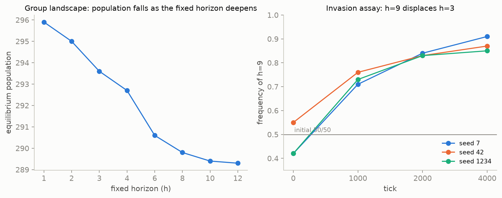
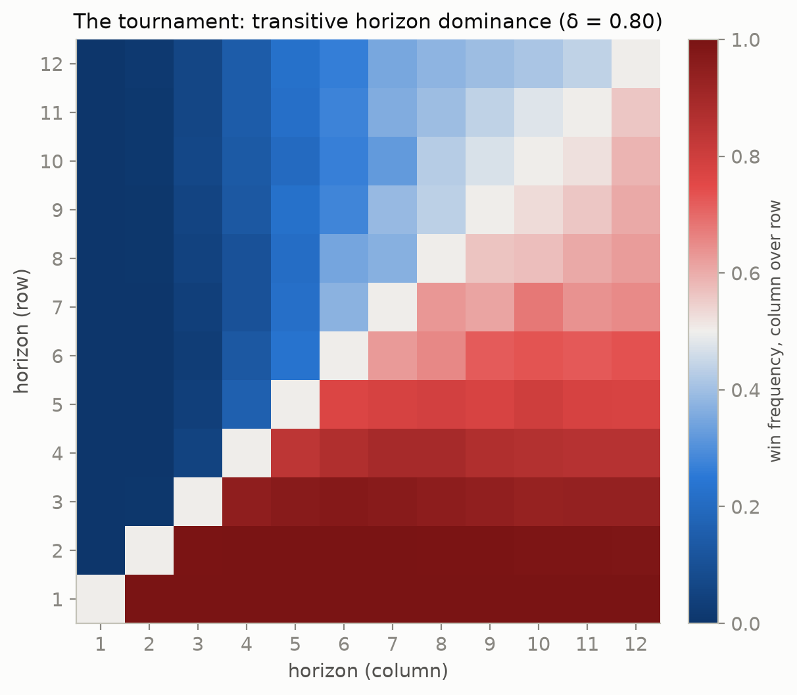
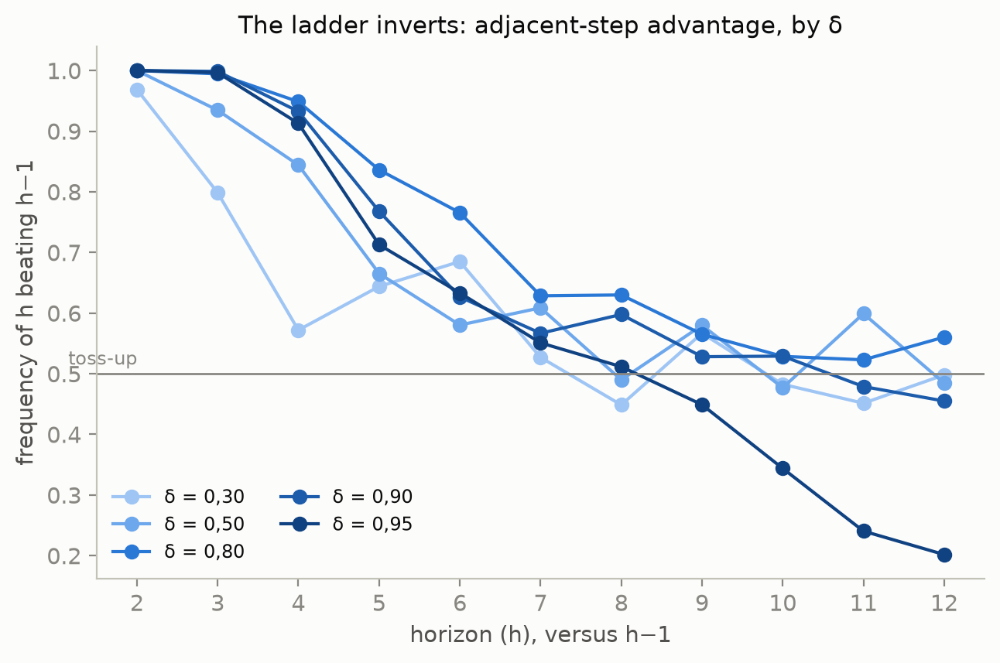
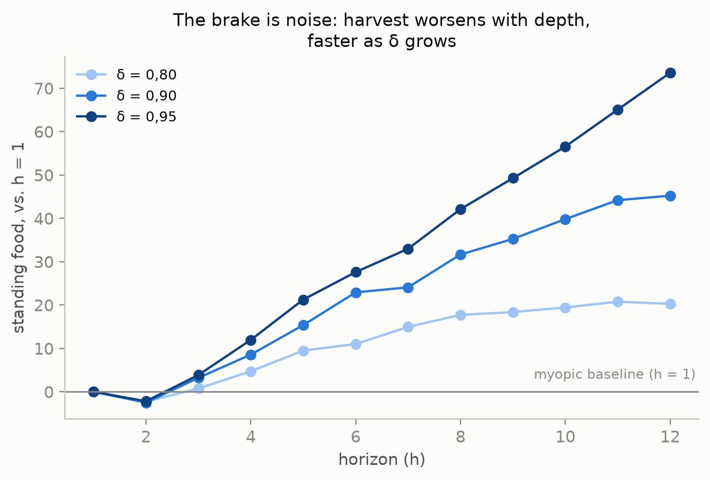
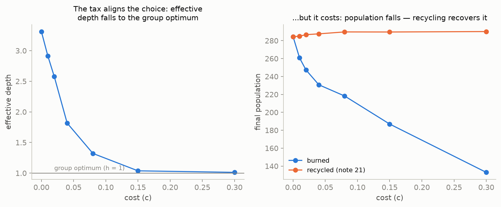
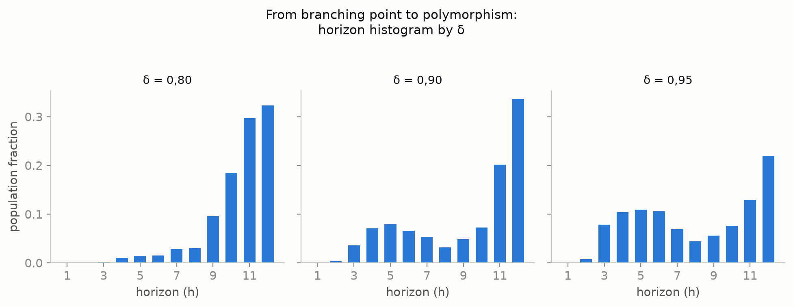

# Cognition as a positional good

### The planning horizon produces nothing — and discounting is what keeps the race from turning into hallucination

*(preprint — English translation of `papers/paper-2-bem-posicional.md`; source of record remains the Portuguese original, including all inline addenda)*

---

## Abstract

In a minimal, deterministic simulated world, agent-blocks plan `h` ticks
ahead, discounting the future by `δ`, and both parameters are heritable
traits with mutation. We ask when it pays to think. The answer has three
layers, and each one overturned the previous one.

**First:** planning deep is **individually advantageous and collectively
costly**. Equilibrium population is maximal at `h = 1` and falls
monotonically with depth; and in an invasion trial the deep planner
**displaces** the shallow one. Cognitive horizon is a **positional good**
(Hirsch, 1976) — a Red Queen arms race (Van Valen, 1973).

**Second:** we measured *how much* of a positional good it is. It is
**pure**. In a single-type population, with no rival of another type,
every planning step past the second makes the block **harvest worse**:
with `h = 12`, +20 units of standing food are left over versus `h = 1`
(`t = +12.5`). The horizon **produces nothing**. Everything it buys is
taken from a neighbor.

**Third, and this is the one that surprised us:** the race **has an
endogenous brake**, and the brake is not the price of cognition — it is
the **imprecision of the prediction itself**. Discounting is not
impatience: it is a **regularizer**. It decides how much weight the plan's
hallucinated tail receives (`δᵏ`). At `δ = 0.80` the tail is discounted
into irrelevance and the extra depth is harmless; at `δ = 0.95` it enters
with half its weight, and there planning deep is *absolutely* bad — a
single-type population with `h = 12` sustains 5.5 fewer blocks than the
same population with `h = 8` (`t = −4.3`), with no one there to take its
food. The damage shows a dose-response in `δ` and **more than triples**
from 0.80 to 0.95.

From this follows a counter-intuitive result we report as the strongest
of the paper: **more patience ⇒ a shallower optimal horizon.** The more
weight is placed on the distant future, the less far one can look without
being poisoned by one's own prediction.

And from this follows the boundary of the thesis: the horizon is a
positional good **where discounting protects it**. Above that, it is not
an expensive good — it is a **mistake**, and selection corrects it.

---

## 1. The question

"Evolution learns to plan farther ahead" is a common narrative, and in
this world it is ill-formed in two senses.

The first is metrological: `horizon` **is not identifiable on its own**. A
block with horizon 11 and discount 0.66 weighs the 3rd step at
`0.66³ ≈ 0.29` and the 11th at `0.01`: it *declares* a deep horizon and
**thinks shallow**. The two traits are compensatory —
`corr(horizon_mean, discount_mean)` = −0.93 / −0.46 / −0.72 in the late
regime — and any claim about planning depth needs the **pair** `(h, δ)`.
Much of the between-seed divergence that fooled us through three
hypotheses was an artifact of looking at a non-identifiable trait in
isolation.

The second is substantive, and it is this paper's subject: in the part
where the narrative is true, **it is not the good news it looks like.**

## 2. The apparatus, and why a toy

A single ~56 KB C file, libc only. Blocks occupy a grid, eat procedural
food patches, spend energy to exist, and reproduce. Each block decides by
looking **only at its 3×3 neighborhood**; none reads global state. Four
traits govern the decision (`urgency`, `space_weight`, `discount`,
`horizon`), inherited with mutation.

The property that makes the apparatus useful is **total determinism**: the
entire universe is `f(seed)`. This buys what a real system does not give
— **pinning a trait** across the whole population and re-running the
*same* world; running **invasion trials** with exact inheritance, where
the trait mean in the log *is* the frequency; and comparing conditions
without the world shifting underneath.

## 3. The positional good (the first layer)

**Group landscape.** Fixing `horizon = h` across the whole population,
equilibrium population falls **monotonically**:

| h | 1 | 2 | 3 | 4 | 6 | 8 | 10 | 12 |
|---|---|---|---|---|---|---|---|---|
| pop | **295.9** | 295.0 | 293.6 | 292.7 | 290.6 | 289.8 | 289.4 | 289.3 |

The group optimum is `h = 1`. The deeper the population thinks, the
**smaller** it is.

**Individual fitness.** Invasion trial, 50/50 of `h = 3` and `h = 9`, no
mutation. The frequency of `h = 9` rises monotonically across three
seeds, to 0.91 / 0.87 / 0.85 over 4,000 ticks. The deep planner
**displaces** the shallow one.

{width=90%}

**Figure 1.** The two measurements side by side: group population falls
as the fixed horizon deepens (left), while the deep planner `h=9`
displaces the shallow one `h=3` in a direct invasion trial (right). The
mismatch between the two **is** the finding.

The mismatch between the two measures **is** the finding, and it has the
classic shape: thinking deep is individually advantageous and
collectively bad. This is also why zeroing out competition makes evolved
horizons **shallower** — competition does not restrain thinking, it
**feeds** it. The gain from looking deep lies in **winning the
neighbor's contested cell**, not in growing the pie.

## 4. The tournament, and an ESS that wasn't (the second layer)

The 3×9 pair is suggestive, not an evolutionarily stable strategy (ESS;
Maynard Smith & Price, 1973; Maynard Smith, 1982). We ran the full
tournament: **66 pairs × 8 seeds × 6,000 ticks**, 50/50 population,
**only the horizon varying** (discount pinned at 0.80, otherwise the §1
compensation contaminates the contrast).

Dominance is **transitive and perfect**: each horizon beats exactly one
more duel than the previous one; `h = 12` beats all 11, `h = 1` loses all
11. No cycle, no hidden mixed strategy. And the margin **saturates**: from
total annihilation (1.000 against `h = 1`) to near coin-flip (0.52–0.56 at
the top) — but it never turns non-positive, and so **the ESS is the
ceiling** `h = 12`, censored by the world's maximum. A race with no
endogenous brake.

{width=90%}

**Figure 2.** The full matrix of the 66 pairs. Dark blue in the
bottom-left corner, dark red in the top-right: transitive and perfect
dominance — every larger horizon beats every smaller one — with the
margin saturating (whitening) near the ceiling `h = 12`.

We read this saturation as the **ceiling of effective depth**
`min(h, 1/(1−δ))`: with δ = 0.80, `1/(1−0.80) = 5`, and the curve's knee
fell at `h ≈ 4–6`. The **fixation → polymorphism** transition (exclusion
below, coexistence above) fell at `h ≈ 4` — "exactly at the discount
ceiling," we wrote.

**This was wrong, and the error was a one-point error.** Effective depth
tied the whole argument together and had been measured at a single δ; at
δ = 0.80, `1/(1−δ) = 5` — and `h ≈ 5` is also the **midpoint** of the
1..12 range. From one point, no one can distinguish "the knee is the
discount ceiling" from "the knee just happened to land in the middle of
the ruler."

We swept δ ∈ {0.30, 0.50, 0.80, 0.90, 0.95} (ceiling from 1.4 to 20), 15
pairs × 8 seeds, with the same tournament binary — the δ = 0.80 slice
reproduces the original tournament in **120/120 rows**, which anchors the
two measurements together. Three results:

**(a) The knee moves — until it stops moving.** The last step with a
significant advantage goes from `h ≈ 2` (ceiling 1.4) to `h ≈ 3` (ceiling
2), `h ≈ 7` (ceiling 5), and `h ≈ 9` (ceiling 10). Censoring shows up
where it should. But at δ = 0.95 (ceiling 20) it **comes back** to
`h ≈ 6`. `1/(1−δ)` is a **low-δ approximation**: it describes when extra
depth is *invisible*, and cannot tell when it is *harmful*.

**(b) The transition does not move.** It sits at `h = 4` for
δ = 0.50, 0.80, 0.90, **and** 0.95, while the ceiling runs from 2 to 20.
We had conflated **two scales** that only δ = 0.80 happens to align: the
knee of the margin, governed by the bottom of the ladder (where discount
has leverage), and the transition, governed by the top — where the
*relative* increment in depth is large (1→2 doubles; 11→12 adds 9%) and
discount has no leverage at all.

**(c) ESS = ceiling was an artifact of 0.80.** At δ = 0.95 the ladder
**inverts**: the last three rungs score 0.344, 0.240, and 0.202
(`t` = −5.5, −13, −14). **The shallow one wins.** Long-range duels — an
independent measurement with non-adjacent pairs — agree: `h = 9` beats
`h = 12` (`t = −11`), `h = 6` beats `h = 12` (`t = −4.4`). **There is an
interior singular strategy** (Geritz, Kisdi, Meszéna, & Metz, 1998). And
the optimum **falls** as δ rises: ≥ 12 at 0.80; ~10 at 0.90; ~7–8 at 0.95.

{width=90%}

**Figure 3.** The advantage of each adjacent step (`h` versus `h−1`), one
line per δ. At low δ (light blue) the line collapses early toward a
toss-up; at δ = 0.95 (dark blue) it **crosses below 0.5** at the higher
horizons — the extra step stops paying off, and the ladder inverts.

## 5. The brake is noise, not position (the third layer)

The inversion admitted two readings, and they make opposite predictions:

- **Noise** — the deep prediction is worse *against the world*. The
  deficit is **absolute** and shows up even with no rival of another type.
- **Stubbornness / positional** — the prediction is correct; the deep
  planner only loses because a shallow one arrives first at the food it
  planned for. Without a rival, the deficit **vanishes**.

The discriminant is a distinction this project already carries
(*equilibrium population is a proxy for the group; for individual
fitness, an invasion trial*): run **single-type** populations — every
block with the same `h` and the same δ — and see whether the *duel's*
inversion has a **solitary** counterpart.

It does. **Paired** difference by seed (the same seed across every `h`), 8
seeds:

| δ | `pop(h=12) − pop(h=8)` | `standing_food(h=12) − standing_food(h=8)` |
|---|---|---|
| 0.80 | +2.04 ± 1.25 (`t = +1.6`) | +2.54 (`t = +2.1`) |
| 0.90 | −1.08 ± 1.25 (`t = −0.9`) | +13.55 (`t = +8.3`) |
| 0.95 | **−5.51 ± 1.27 (`t = −4.3`)** | **+31.45 (`t = +14.9`)** |

At δ = 0.95, an entire world of `h = 12` blocks sustains **5.5 fewer
blocks** than the same world with `h = 8` — and **there is no `h = 9`
around to take its food.** The deficit is not positional: it is against
the world. And the material trace is in the food **no one harvested.**

**The dose-response is the signature.** Standing food, paired against
`h = 1`:

| `h` | δ=0.80 | δ=0.90 | δ=0.95 |
|---|---|---|---|
| 2 | **−2.3** `t−4.3` | **−2.5** `t−3.8` | **−2.2** `t−3.1` |
| 6 | +11.0 `t+7.9` | +22.9 `t+10.2` | +27.6 `t+13.7` |
| 12 | +20.3 `t+12.5` | +45.2 `t+14.4` | **+73.6** `t+17.3` |

{width=90%}

**Figure 4.** The full curve from `h = 1` to `12`, for the three δ. The
harvesting peak (`h = 2`, the only dip below zero) is the same across
all three; what changes is the slope after it — three times steeper at
δ = 0.95 (dark blue) than at δ = 0.80 (light blue).

Three readings, and the third is the thesis:

**The harvesting peak is `h = 2`.** It is the only step that harvests
better than the myopic one, at all three δ. One planning step pays off.
**From `h = 3` onward, every additional step worsens the harvest**,
monotonically, without exception.

**The damage exists at every δ — including 0.80**, where depth does not
cost population (`t = +1.6`). In other words: in this world, **planning
deep never harvested better.**

**And discounting controls how much.** The same `h = 12` leaves +20.3 /
+45.2 / **+73.6** as δ goes to 0.80 / 0.90 / 0.95: the damage **more than
triples**. The tail's error is the same across all three — same world,
same depth. What changes is `δᵏ`, **the weight the decision gives it**.
At δ = 0.80, `0.8¹¹ ≈ 0.09`: the wrong tail enters discounted almost to
nothing. At δ = 0.95, `0.95¹¹ ≈ 0.57`: it enters with more than half its
weight, and costs 5.5 blocks.

> **Discounting is a regularizer.** It is not impatience: it is the block
> refusing to trust a prediction it cannot make.

This dissolves the counter-intuitive result of §4(c) without paradox: the
more weight is put on the distant future, the less far one can look
without being poisoned by one's own prediction. And it reinterprets the
compensation of §1: the block that declares horizon 11 and discount 0.66
**is not gaming the metric** — it is protecting itself from its own
hallucination. Lowering the discount is adaptive because it
**regularizes**.

## 6. The synthesis: evolution lands past the productive optimum, and the surplus is position

Three independent measurements meet at one number:

| quantity | value | source |
|---|---|---|
| **harvesting** optimum | `h ≈ 2` | single-type (§5) |
| **group** optimum (population) | `h = 1` | group landscape (§3) |
| **evolved** effective depth, no tax | **3.31 ± 0.24** | free evolution (§7) |

Evolution lands **past** the productive optimum — by about a step and a
half — and this surplus is **exactly the positional good**: depth that
harvests nothing and exists only to win the neighbor's cell. The Red
Queen, measured in steps.

And now the boundary. The horizon is a positional good **where discounting
protects it** (δ ≲ 0.90): there, the extra depth is *harmless* — it does
not cost population — and still **wins duels**. This is the definition
of a positional good: it produces nothing, and one still needs it to
avoid being displaced. Above that (δ = 0.95), the extra depth is
*absolutely* bad, and there it is not an expensive good: it is a
**mistake**, and selection corrects it. This correction is what produces
the interior singular strategy of §4(c).

## 7. The tax, and why aligning the choice is not the same as restoring welfare

If the deep planner imposes on the commons a cost it does not pay, the
classic remedy is to internalize the externality: `METABOLISM +
c · depth`. A **Pigouvian tax on cognition** (Pigou, 1920).

We swept `c` across 7 values × 8 seeds × 30,000 ticks, with horizon and
discount **free** (only the metabolic bill changes). The tax is charged
on **effective depth**, not on declared horizon — otherwise the block
would escape by lowering its discount, paying for steps that no longer
carry weight. The choice of what to tax is not a detail: it is the
difference between an instrument that bites and one that slips, and the
evidence justifying it is the non-identifiability of §1 (`horizon_mean`
has an SD up to **15×** that of effective depth; only when the tax is
strong enough to pin everything at `h = 1` do the two readings converge).

| `c` | effective depth | population |
|---|---|---|
| 0 | **3.31 ± 0.24** | 284.4 |
| 0.04 | 1.82 ± 0.23 | 230.7 |
| **0.15** | **1.04 ± 0.02** | 186.9 |
| 0.30 | 1.01 ± 0.01 | 133.0 |

Evolved depth falls monotonically and **lands on the group optimum**
(`h = 1`) at `c ≈ 0.15`. The predicted coincidence — a `c` at which
individual and collective interest align — happened without tuning: it
falls exactly where depth hits the `h = 1` that §3 had already measured,
independently. The Pigouvian mechanism **works**, in the precise sense in
which it was asked to.

**And the price was not in the budget.** Population falls monotonically
with the tax: the `c` that aligns the choice has already cost **~35% of
the population** (284 → 187). In a textbook Pigouvian tax the revenue is
**redistributed**; here it is **burned** — extra metabolism that
vanishes. So the tax does not correct the externality for free: it
corrects **by digging an energy hole**. The positional externality §3
measures is small (~2% of population between `h = 1` and `h = 12`); the
"cure" costs an order of magnitude more than the "disease."

> **Aligning the choice is not the same as restoring welfare**, when the
> instrument of alignment is itself destructive. Whoever pays for
> coordination, pays.

And there is now an irony that §5 adds: **this world already had a
brake**, and it is free. The exogenous, burned tax competes with an
endogenous mechanism — the imprecision of the prediction itself — that
produces an interior singular strategy without charging anyone anything.

> **[Addendum, 2026-07-26, note 21: the central conclusion of this
> paragraph was corrected — "aligning ≠ restoring welfare" was a property
> of burning the revenue, not of the Pigouvian tax itself.]** A
> per-capita dividend (the tax pool returned equally to every survivor,
> every tick) preserves the alignment almost untouched — evolved depth
> falls to the same place, within 0.16 of the burned version at every `c`
> (R1) — and **restores welfare beyond the baseline**: at the
> `c = 0.15` that aligns, the burned population is 66% of the no-tax
> baseline; the recycled one is **102%** (R2/R3). The pre-registered
> caveat — that redistributing to survivors near the reproduction
> ceiling would leave a residual cost — was **falsified in the favorable
> direction**: the residual is a surplus of ~2% at every `c ≥ 0.01`, of
> the same order as the positional externality §3 measures between
> `h = 1` and `h = 12` (a candidate reading, not experimentally
> isolated). The irony in this paragraph also changes shape: the two
> brakes — the endogenous one (§5, prediction imprecision) and the
> recycled exogenous one (note 21) — do not compete over who charges
> less; **both are already free**, through different mechanisms.
> `datasets/reciclagem.csv`, `papers/notes/21-o-imposto-que-recicla.md`.]**

{width=90%}

**Figure 5.** Left, effective depth falls monotonically and hits `h = 1`
near `c = 0.15`. Right, the price of that correction: burned population
(blue) falls throughout; recycled (orange, note 21) sits **above** the
baseline instead of below it.

## 8. Threats to validity

- **The missing link.** We proved that the deep type harvests worse and
  that the damage scales with δ. We did **not** directly measure the
  k-step prediction error. §5 is inference to the best explanation, not a
  measurement of the link — closing it requires a probe comparing
  `predict_value` step by step against the realized outcome, and none
  existed.
  **[Addendum, 2026-07-20, note 18: the probe was built and the link
  closed — shorter than this paragraph feared. Only the plan's first
  step carries information (corr(ĝ₀, r₀) = 0.60–0.73; corr ≤ 0.19 from
  k=1 onward — k\* = 0 in every populated condition, 8/8 seeds), the
  premise of persistence dies at the very first replanning, and the
  tail's error *worsens* with δ (anticorrelation at δ=0.95): the
  inference of §5 becomes measurement, with a second channel — deep
  behavior fabricates part of its own noise. Remaining boundary: the
  probe measures the plan as *prediction*, not as *ranking* among
  candidate cells (`datasets/sonda-erro.csv`).]**
  **[Addendum, 2026-07-26, note 22: the remaining boundary was closed —
  the ordinal probe. The plan fails as a prediction (k\* = 0, note 18)
  but ORDERS the up-to-9 candidate cells far better than chance:
  pairwise discordance between the predicted rank (`predict_value`
  alone) and the rank of what was actually extracted from each cell, by
  whoever, sits at 0.17–0.20 (chance = 0.5) in every populated
  condition, and the argmax hit rate is 3.8–4.5× chance — 8/8 seeds,
  100.000% exact reconstruction of the real decision. Discordance
  barely worsens from `h = 4` to `h = 12` (|Δ| ≤ 0.015, against the
  collapse of `corr(g_k,r_k)` from note 18 already at `k = 1`): a
  candidate mechanism for the harvesting peak `h = 2` from note 17 — the
  RANK does not degrade the way the VALUE degrades. And the full
  decision (`u`, with the space term) tracks the realized outcome
  *better* when the block is hungry than when it is sated (Δ = 0.02–0.11
  in favor, 8/8 seeds, `t` up to 29) — space recedes exactly when it
  should, by design, not by failure. Algebraic control: in the hermit (no
  rivals perceived), `space` is constant across candidates and
  `rank(u) ≡ rank(m)` by construction (an affine map, positive slope) —
  and the same comparison comes out **inverted** there (`t = −29`), as
  the algebra requires. `datasets/sonda-ordinal.csv`,
  `papers/notes/22-a-sonda-ordinal.md`.]**
- **Standing food is a property of the world, not of the block.** More
  standing food is evidence of worse harvesting, but it is aggregate: it
  does not distinguish "every block harvests less" from "blocks cluster
  and leave regions untouched." Both are forms of worse harvesting; the
  second would be a spatial story, not a temporal-noise one.
- **8 seeds** in the tournaments and single-type runs; **3 seeds** in
  Phase 3 (§3). The effects that decide come out at `t` of 4 to 17; the
  nulls are *measured* nulls (`t = +1.6`), not "we cannot tell" — except
  at δ = 0.30, where the SD is 0.2–0.4 and the plateau is honestly "not
  distinguishable from 0.5 with 8 seeds."
- **Single-type ≠ hermit.** The blocks still see each other and contest
  cells; what does not exist is a block of a **different `h`**.
- **A 5-point discount grid.** The inversion lives between 0.90 and 0.95;
  exactly where the optimum leaves the ceiling, this grid cannot say.
  **[Addendum, note 19: the fine grid δ∈[0.88,0.96] answered this —
  `h*(δ)` falls 12→10→9→8→8→7 while `1/(1−δ)` rises 8.3→25 (opposite
  directions), and the ceiling is abandoned between δ=0.88 and 0.90
  (`datasets/grade-fina.csv`).]**
- **50/50, not rare-invader.** With an interior singular strategy, the
  distinction started to matter for real — far more than it mattered
  when the ESS was the ceiling.
  **[Addendum, note 20: the rare-invader trial ran, and it renamed the
  finding — the interior point is NOT an ESS. Rare invaders from both
  sides grow (it is not uninvadable), but the rare `h*` invades both
  residents (it is convergence-stable): the textbook signature of an
  **evolutionary branching point** (Geritz et al., 1998). The "interior
  ESS" of §4/§6 above is, more precisely, the center of a **protected
  polymorphism** — which also gives a second, structural cause for the
  dispersed `horizon_mean` of note 15. Wherever the text says "interior
  ESS," read "convergence-stable, invasible interior singular strategy"
  (`datasets/invasor-raro.csv`). Direct test still missing: does free
  evolution produce a bimodal distribution of horizons?]**
  **[Addendum, 2026-07-26, note 23: the direct test ran, with a two-layer
  answer. In the SAME pinned background as this note (only the horizon
  free to mutate over 1..12), the branching point turns into REAL
  polymorphism — 8/8 seeds bimodal (mass ≥15% on both sides of `h*`)
  from δ=0.90 onward, full saturation (δ=0.80 gave 4/8, more ambiguous
  than expected from the paired dominance of notes 14/16). But in the
  REAL evolutionary run (urgency/space_weight/strategy also free), NO
  seed is bimodal — every run converges to a single peak, and it is the
  peak that disperses across seeds (mode 3 to 9, `sd=2.12`). The
  co-evolution of the other three traits does not erase the structural
  point — it erases *visible* bimodality, replacing it with
  path-dependence: each realization commits, early, to a different point
  of the same possibility space, never splitting the bet within a single
  run. It is the mechanism, now seen acting, behind the dispersed
  `horizon_mean` note 15 measured as a symptom.
  `datasets/bimodalidade.csv`, `papers/notes/23-o-teste-de-bimodalidade.md`.]**
  **[Addendum, 2026-07-26, note 26: the "δ=0.80 gave 4/8, more ambiguous"
  above got resolved. A classifier that DISCOVERS the valley on its own
  (comparing each bin against the running maximum on each side, without
  being told `h*`) re-analyzes the same histograms and votes 0/8 at
  δ=0.80 — what the fixed partition read as "mass on both sides" is a
  tail skewed toward the ceiling `h=12`, not two peaks separated by a
  valley. It reads in favor of **mutation load**, not real branching, at
  δ=0.80 — and confirms δ≥0.90 by an overwhelming majority (6-7/8),
  including discovering the valley exactly at the theoretical `h*`
  (δ=0.95, seed 1) without being told.
  `papers/notes/26-duas-linhagens-sem-h-conhecido.md`.]**
  **[Addendum, 2026-07-26, note 28: the "mutation load" verdict above was
  ISOLATED, not just voted on — and the answer is MIXED, not the single
  verdict note 26's addendum suggested. Turning off horizon mutation
  (only the initial 1..12 seeding supplies variation), **6/8 seeds
  collapse** to near-monomorphism at the ceiling (low-side mass falls to
  0.1–3.3%) — mutation load confirmed in those. But **2/8 do the
  opposite of what was predicted**: with no new mutants at all, the
  low-side mass **grows** (0.39→0.58; 0.27→0.51) and the valley gets
  **cleaner**, not shallower (one seed reaches **zero** mass in the
  valley, across 20 samples over 5,000 ticks) — the signature of genuine
  polymorphism in a fraction of realizations, not mutational noise.
  δ=0.80 has no single verdict: it is a historically loaded boundary —
  which basin (pure ceiling or coexistence) a population visits depends
  on its initial trajectory, not on δ alone.
  `datasets/mutacao-off.csv`, `papers/notes/28-mutacao-ou-ramificacao-em-delta-080.md`.]**

{width=90%}

**Figure 6.** The full histogram behind the notes 26/28 verdict. At
δ = 0.80 the mass is a tail skewed toward the ceiling — no valley. At
δ = 0.90 and 0.95 both sides of `h*` gain mass of their own: the
branching point turned into visible polymorphism.

- **`HORIZONTE_MAX = 12` censors** the top at low and medium δ.
- **One world.** "Depth produces nothing" is a property of *this* world —
  procedural food patches, a 3×3 neighborhood, one step per tick. A world
  with a more predictable reward structure should move the harvesting
  optimum upward, and that is an experiment, not an opinion.

## 9. What this means, if it means anything

The narrative "evolution learns to plan farther ahead" is, here, three
things at once. It is **ill-formed** (the horizon is not identifiable
without the discount). It is **true in a narrow regime** (one planning
step pays off; the second already does not). And, where it is true, **it
is not good news**: the depth evolution adds past the second step does
not grow the pie — it transfers. Every block has to think deeper just to
stay in place, and it comes at a cost for everyone.

What the 56 KB world adds to the Red Queen commonplace is the **brake**.
It did not come from a tax, nor from a metabolic cost, nor from a design
ratchet. It came from the product **rotting with distance**: the deep
plan is a prediction the world does not honor, and discounting is the
only organ that decides how much of that lie enters the decision. An arms
race for a good that does not exist is self-limiting — not out of virtue,
but because at some point the weapon starts firing backward.

If this holds for the 56 KB creature, the question is worth asking for
the others.

---

## Appendix — reproduction

There is **one** canonical `main.c`; every variant is a patch on a
temporary copy, and every script accepts an alternate `main.c`
(`git show <commit>:main.c`). Every claim in this paper has a note, a
script, and a dataset:

| section | note | script | dataset |
|---|---|---|---|
| §1, §3 (positional good, compensation) | Phase 3 of `ROADMAP.md` | — | — |
| §4 (tournament, ESS at δ=0.80) | 14 | `14-torneio.sh` | `torneio.csv` |
| §4 (δ sweep, interior ESS) | 16 | `16-desconto.sh` | `desconto.csv` |
| §5, §6 (noise vs. stubbornness; harvesting) | 17 | `17-tipo-unico.sh` | `tipo-unico.csv` |
| §7 (Pigouvian tax) | 15 | `15-imposto.sh` | `imposto.csv` |
| §7 (addendum — per-capita dividend) | 21 | `21-reciclagem.sh` | `reciclagem.csv` |
| §8 (addendum — the ordinal probe) | 22 | `22-sonda-ordinal.sh` | `sonda-ordinal.csv` |
| §8 (addendum — the bimodality test) | 23 | `23-bimodalidade.sh` | `bimodalidade.csv` |

The notes (in `papers/notes/`, Portuguese, dated) record **dead
hypotheses** — three in Phase 3, and the entire mechanism of §4, which
note 16 overturned after note 14 had published it. In a project whose
thesis is about what a measure carries, a dead hypothesis is data. **The
order in which the errors were made and corrected is on record in the git
history, and each note's pre-registration was committed before its run.**

## References

- Dawkins, R., & Krebs, J. R. (1979). Arms races between and within
  species. *Proceedings of the Royal Society of London. Series B*,
  205(1161), 489–511.
- Doebeli, M., & Dieckmann, U. (2000). Evolutionary branching and
  sympatric speciation caused by different types of ecological
  interactions. *The American Naturalist*, 156(S4), S77–S101.
- Geritz, S. A. H., Kisdi, É., Meszéna, G., & Metz, J. A. J. (1998).
  Evolutionarily singular strategies and the adaptive growth and
  branching of the evolutionary tree. *Evolutionary Ecology*, 12(1),
  35–57.
- Hirsch, F. (1976). *Social Limits to Growth*. Harvard University Press.
- Maynard Smith, J. (1982). *Evolution and the Theory of Games*.
  Cambridge University Press.
- Maynard Smith, J., & Price, G. R. (1973). The logic of animal conflict.
  *Nature*, 246, 15–18.
- Pigou, A. C. (1920). *The Economics of Welfare*. Macmillan.
- Van Valen, L. (1973). A new evolutionary law. *Evolutionary Theory*, 1,
  1–30.
